# WGT recognizer — NEW vs OLD: a correctness, capability, and performance report

This report consolidates the multi-phase verification and improvement of the WGT recognizer
("Wheelie", `recognizer/src/`) and the exponential baseline (`benchmark/exponential_recognizer/`),
and compares the **NEW** code (the fixed/sparsened `devel` branch) head-to-head against the **OLD**
code, rebuilt from the exact historical commits. Every claim traces to a re-runnable command and a
data file; §9 is the reproduction manifest.

> **The cardinal rule of this report: three axes, never merged into one "X % better."**
> A faster wrong answer is not progress. We separate
> **(1) correctness** (does the verdict match ground truth?),
> **(2) capability** (can it produce a verdict at all?), and
> **(3) performance** (how fast / how big, *on the graphs where the verdict is already correct*).

---

## Executive summary

| Axis | Metric | OLD | NEW | Evidence |
|---|---|---|---|---|
| **Correctness — recognizer** | false-accepts on a reject-heavy random corpus (4559 non-WG) | **950** via `-s p` and **950** via `-s p -e` (20.8%) | **0** (all backends) | Fig 1, `data/corr_buggy.log` / `corr_new.log` |
| **Correctness — recognizer** | verdict agreement with the brute-force n! oracle | n/a (buggy) | **2447 / 2447, 0 disagreements** | Fig 2, `VERDICT_AGREEMENT.md` |
| **Correctness — exp baseline** | could it ever output "not a Wheeler graph"? | **no** — returned WG for *every* in-cap graph | **yes** — honest 3-way verdict | Fig 1, `data/exp_unsound.log` |
| **Capability** | non-WG biological graphs decided (n≤9 subset) | **0 / 7** (OLD exp timed out on all of them) | **7 / 7** | Fig 3, `PHASE3_IMPACT.md` |
| **Capability** | graphs the OLD exp baseline could decide at all | timed out on **159 / 931** | **931 / 931** | Fig 3 |
| **Performance — `-f`** | total `-f` time, DOCK4 DNA k=5 (1041 edges) | 15.2 s (pre-4.1) | **6.6 s** (≈ **2.3×**) | Fig 7, `data/micro.setup_solve.csv` |
| **Performance — `-f`** | encoding *setup* time, same graph | 2.1 s | **0.14 s** (≈ **14×**) | Fig 7 |
| **Performance — `-f`** | encoding size in SMT atoms (validated ≡ z3 `s.assertions()`) | O(E²) (fit `∝E^2.00`, all types) | **median ≈13× fewer** (up to ~300×); sub-quadratic `∝E^1.57` where the A3 block fires | §4.0, Fig "atoms", `data/atom_counts.csv` |
| **Performance — `-f` by type** | total speedup pre-4.1 → NEW, 4 biological types (900-job grid; 682 paired) | 1× (pre-4.1) | **1.3–2.2×** (DNA via A3, AA via A2; 0 regressions) | §4.5, Fig 12, `data/ftiming_bytype.raw.jsonl` |
| **Capability — scale** | largest graph recognized, default SMT `complete` / `dnfa` families | exp baseline CAPPED at n=10 | **2816 / 2176 in 600 s; 4608 / 3584 in 1 h** (THRESHOLD, ≈280–460× past exp) | §5, `results_1hr/summary/` |
| **Repair** | non-WG DAGs repaired to a verified WG (strings preserved) | n/a (did not exist) | **316 / 316 repaired, 0 failures** (820 DAGs) | Fig 11, `data/repair_records.json` |
| **Practicality — MSA→WG** | real Ensembl gene MSAs (50 genes) built into graphs and recognized | n/a | **500 / 500 decided in < 1 s**; De Bruijn & trie 100% Wheeler, RevDet 1% | §7, Fig 15, `data/msa_practicality.csv` |

**One-paragraph version.** The OLD recognizer's permutation backends *false-accepted* non-Wheeler
graphs, and the OLD exponential baseline was not a decision procedure at all — it answered "Wheeler"
for every graph it finished and timed out on every non-Wheeler instance, so its published verdicts
were meaningless. The NEW code agrees with an independent n!-enumeration oracle on **2447** graphs
with **zero** disagreements, and decides non-Wheeler verdicts the OLD baseline was structurally
incapable of. On top of that — *correctness first, performance second* — the Phase-4 sparse `-f`
SMT encoding cuts encoding **setup** universally (~14× at k=5) and **total** `-f` time ~2× on the
largest *Wheeler* DNA graphs. Building this report's sweeps also **caught a regression in the
committed Phase 4.2 code** (its block-encoding guard fired too eagerly and slowed z3 on dense /
non-Wheeler instances); the verification motivated a one-line fix (**Phase 4.3**, `D < E/2` guard,
re-verified at 0 mismatches over ~9,700 graphs), after which NEW is **≥ OLD on every `-f` graph
measured** — faster on Wheeler instances, neutral on non-Wheeler. None of this touches the
**default** backend, which is the production path and decides these graphs near-instantly.

---

## §1 Background — Wheeler graphs and the deciders

An edge-labeled directed graph `G=(V,E)` is a **Wheeler graph** iff there is a total order `π` on
the nodes such that, for edges `e1=(u1,v1,a1)`, `e2=(u2,v2,a2)`:

- **(A1)** every in-degree-0 node precedes every in-degree-positive node;
- **(A2)** `a1 < a2 ⇒ π(v1) < π(v2)` — a smaller edge label forces an earlier head;
- **(A3)** `a1 = a2 ∧ π(u1) < π(u2) ⇒ π(v1) ≤ π(v2)` — equal label, tail order implies head order.

Deciding whether such a `π` exists is **NP-complete**, so all three deciders here search that
ordering space; they differ only in *how*:

- **recognizer (SMT)** — `recognizer_linux` (default). Three-phase pipeline (`wg.cpp`): Step 1
  `relabel_initialization()` (axiom-implied constraints), Step 2 `innodelist_sort_relabel()` (the
  **renaming heuristic** that narrows each node to an order window `[lb,ub]`), Step 3 `solve_smt()`
  encoding the order as a Z3 `QF_IDL` problem inside those windows.
- **recognizer (permutation)** — `-s p`: enumerates valid orderings per label group with pruning.
- **recognizer (`-f` full-range)** — disables Step-2 narrowing and hands the whole space to SMT;
  this is the path Phase 4.1/4.2 optimize.
- **exponential baseline** — `recognizer_e`: the Gibney–Thankachan reference, now an honest n!
  ordering enumeration that checks the three axioms directly (the over-budget case is reported, not
  guessed).

Authoritative axiom statement (independent of the recognizer): `verify/brute_oracle.py:9-14`.
Full source-grounded algorithm description: `recognizer/ALGORITHM.md`.

---

## §2 Methodology — ground truth, harnesses, provenance

**Ground truth.** `verify/brute_oracle.py` enumerates all `n!` node orderings and checks A1/A2/A3
directly. It shares no code with the recognizer, so agreement is meaningful. It is exact for `n≤9`.

**Differential harnesses.** `verify/difftest.py` (recognizer, all backends) and
`verify/difftest_exp.py` (exponential) generate random labeled digraphs — *including self-loops and
parallel edges* — mixed with generator-built positive WGs and 16 curated structural edge cases
(`verify/edgecases.py`), and compare every verdict to the oracle. For this report both harnesses
gained an environment override (`WGT_REC` / `WGT_EXP`) so one harness drives any historical binary,
and a per-class breakdown (false-accept vs false-reject). `difftest_exp.py --encoding old` decodes
the OLD baseline's inverted column-0 scheme (see below).

**Benchmark row contract.** With `-b`, a decider prints one line `verdict⟨tab⟩nodes⟨tab⟩cpu⟨tab⟩path`.
For the NEW recognizer `verdict` is `1`=WG, `-1`=non-WG, `0`=undecided (z3 `unknown`). The `cpu`
column is raw `clock()` ticks (CPU time, ≈ µs on Linux) — **contention-robust**, so we lead the
performance headline with it and report wall time (`perf_counter`, median of R replicates) as a
cross-check.

**The exp encoding inversion (critical).** The fixed `recognizer_e` uses `1`=WG / `0`=non-WG /
`-1`=over-cap. The *unsound* OLD `recognizer_e` used an **inverted** scheme: `0`="Wheeler",
`-1`="not / over-cap" — and in practice it returned `0` for **every** graph it finished (it never
computed a real non-WG verdict). Decoding it honestly (`0 → WG`) is what exposes its
accept-everything behaviour. A live probe (`/tmp/wgt_probe`): on a 4-node non-WG it prints `0`
(decoded WG = wrong); on a 3-node WG it prints `0` (right by accident). The honest binary prints
`0`(non-WG) and `1`(WG) respectively.

**OLD-binary provenance** (rebuilt from git via worktrees; Z3 statically linked from
`recognizer/src/libz3.a`; build line in §9):

| name | commit | what it is |
|---|---|---|
| `recognizer_buggy` | `8ed7c4eb4` | recognizer **before** the Phase-1 correctness fixes |
| `recognizer_pre41` | `c396d2b56` | `-f` with **dense** A2 (`O(E²)`) + dense A3, before the z3-unknown fix |
| `recognizer_linux_old` (pre-4.2) | `3f9045d2d` | `-f` with **sparse A2** (Phase 4.1) + dense A3 |
| `recognizer_linux` (**NEW**) | `e37960ec7` | `-f` sparse A2 + sparse A3 with the **Phase 4.3** guard `2D<E` + all fixes |
| `recognizer_e` (**NEW exp**) | `devel` | honest n!-enumeration decision procedure |
| `recognizer_e_unsound` | `4cfd7a9e2` | the published exp baseline (accept-everything) |

The committed `recognizer/bin/recognizer` is a **macOS arm64** Mach-O binary and is excluded from
all measurements (it cannot run on this Linux host).

**Plotting environment.** The base conda `python3` has a broken numpy (`numpy.__file__ is None`), so
all figures are rendered with `~/miniconda3/envs/spliceai/bin/python` (numpy 1.23 / matplotlib 3.7).
The harnesses themselves need no numpy.

---

## §3 Correctness — NEW vs OLD

### 3.1 The recognizer false-accepted non-Wheeler graphs (Fig 1)

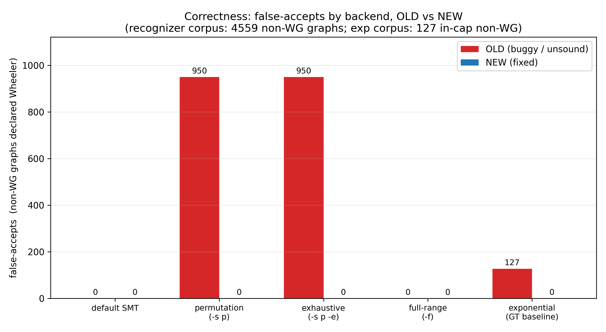

On a reject-heavy random corpus of 6000 graphs (1441 WG / **4559 non-WG**, `--max-n 6`, seed 11),
the OLD buggy binary (`8ed7c4eb4`) **false-accepts** non-Wheeler graphs through its permutation
backends:

- `-s p` (permutation): **950 false-accepts** (20.8% of the 4559 non-WG) — `permutation_start()`
  only ever exited via the accept path; on search exhaustion it fell through to the default
  `valid_wg=true` (bug #1).
- `-s p -e` (exhaustive): **950 false-accepts** — the exhaustive path accepted unconditionally
  (bug #2). **This is the exact mode the paper's GT benchmark used.**

The default SMT and `-f` backends at `8ed7c4eb4` were already correct on this corpus (0 false
verdicts — the bugs were localized to the permutation backends). The NEW binary false-accepts
**0** in every backend (`data/corr_new.log`). The fifth group contrasts the exponential baselines
(see 3.3).

### 3.2 The NEW recognizer agrees with the oracle on every decided graph (Fig 2)

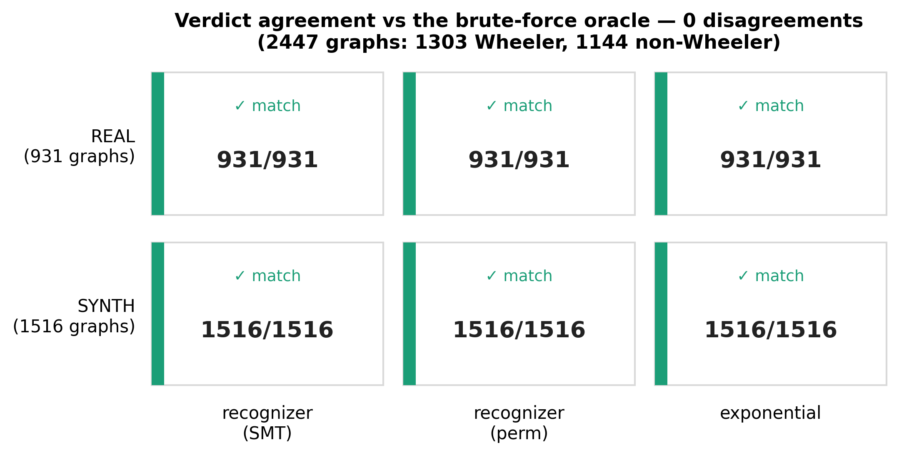

Across **2447** graphs — 931 real n≤9 GT_vs_WGT graphs (accept-heavy) and 1516 synthetic graphs
(379 WG / 1137 non-WG, reject-heavy) — the SMT, permutation, and exponential deciders each agree
with the oracle on **100%** of decided graphs: **0 disagreements** (`VERDICT_AGREEMENT.md`). This
session's `difftest.py` sweep adds a further ≈16.6k graphs with 0 mismatches.

### 3.3 The OLD exponential baseline was not a decision procedure

The published `recognizer_e` (`4cfd7a9e2`) received only scalar counts in its checker (never the
graph's edges), so its L-array check was dead code and it returned "Wheeler" for **every** in-cap
graph — it had no non-Wheeler verdict at all. Decoded in its own scheme, on the in-cap subset it
returned a verdict for, it false-accepts **127 / 127 (100%)** of the non-Wheeler graphs — *every
one* — and emits **0** genuine not-WG verdicts (`data/exp_unsound.log`). It is also impractically
slow: it additionally **hung past the per-graph cap on 60** further graphs (the published code never
handled self-loops / parallel edges). The rewritten honest `recognizer_e` decides the same kind of
corpus correctly — **0 / 1573** false-accepts over 2512 decided graphs (`data/exp_honest.log`) — and
agrees with the oracle on the 931-graph real subset (931/931).

> The two OLD recognizer backends false-accept **20.8%** of non-WG graphs (950 / 4559); the OLD exp
> baseline false-accepts **100%** (127 / 127) and never produces a non-WG verdict at all. Fig 1 shows
> the raw counts (note the differing per-group denominators in its title); the **rate** is the
> apples-to-apples number.

> **Honesty note.** On the *real* GT_vs_WGT corpora the OLD baselines' observed false-accept count
> is **0** — but that is an *artifact*, not a virtue: the OLD exp timed out on every non-Wheeler
> graph (never reaching a verdict), and the 7 non-WG graphs were rejected by the recognizer's
> Steps 1–2 before the buggy `-e` phase. The accept-everything bug is only *exercised* by the
> synthetic reject-heavy corpus and the rebuilt buggy binary — which is exactly why Fig 1 uses them.

### 3.4 Capability — verdicts the OLD baseline could not produce (Fig 3)

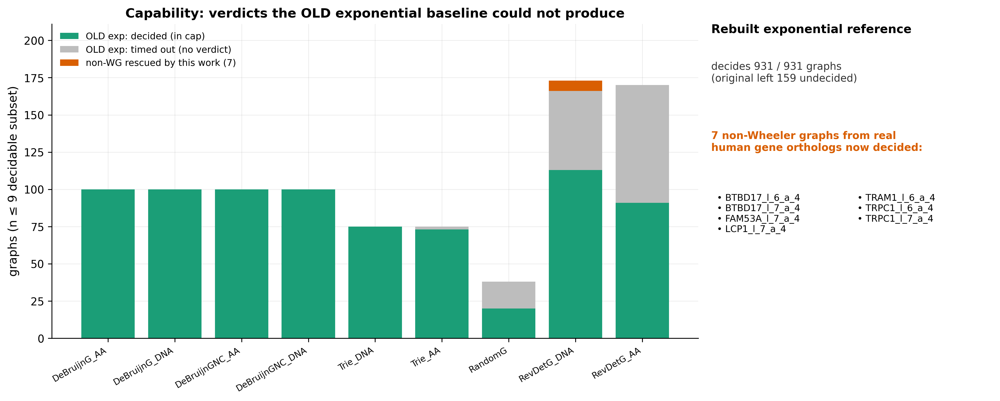

Correctness asks "is the verdict right?"; **capability** asks the prior question "can a verdict be
produced at all?" On the n≤9 oracle-decidable subset of the paper's GT_vs_WGT corpora (931 graphs,
`PHASE3_IMPACT.md`), the OLD exponential baseline timed out on **159 / 931** — including **all 7**
non-Wheeler graphs — so it could *never* classify a single non-Wheeler instance. The honest
`recognizer_e` decides **931 / 931** correctly, among them those **7 non-Wheeler RevDetG_DNA
orthologue graphs** (BTBD17, FAM53A, LCP1, TRAM1, TRPC1) — verdicts the published baseline was
structurally incapable of emitting. Scaling capability (largest graph decidable within a time budget)
is §5.

---

## §4 Performance — sparser `-f` encodings and where they pay off

The `-f` path is where Phase 4.1/4.2 live. It hands the entire order space to z3, so the **encoding
size** dominates. The two sparsifications:

| constraint | OLD `pre-4.1` (`c396d2b56`) | Phase 4.1 `pre-4.2` (`3f9045d2d`) | Phase 4.2 **NEW** (`d0c02ca37`) |
|---|---|---|---|
| cross-group **A2** (head ordering between labels) | `O(E²)` all-pairs | **`O(E+L)`** per-label head-boundary (`#lo_/#hi_`) | `O(E+L)` |
| within-group **A3** (head order from tail order, per label `l`) | `O(E_l²)` all-pairs | `O(E_l²)` all-pairs | **`O(D_l²+E_l)`** endpoint-block (`#mn_/#mx_`), `D_l=min(distinct tails,heads)` |

The Phase 4.2 block form is **equisatisfiable** with the all-pairs form (all atoms stay in QF_IDL;
proof sketch in `ALGORITHM.md`) and is used only behind a guard **`2·D_l < E_l ∧
D_l(D_l−1)+2E_l < E_l(E_l−1)`**. The atom-count clause alone (Phase 4.2) proved insufficient — it
fires up to `D_l ≈ 0.7·E_l`, where the block's auxiliary variables make z3 *solve* slower despite
fewer atoms (this report's verification caught it; §4.2/§5). The **`D_l < E_l/2`** clause (Phase 4.3)
restricts the block to the regime where it genuinely helps, so all-distinct *and* merely-dense
groups fall back to the verified pairwise loop.

### 4.0 The mechanism, measured directly: encoding size in atoms (Fig “atoms”)

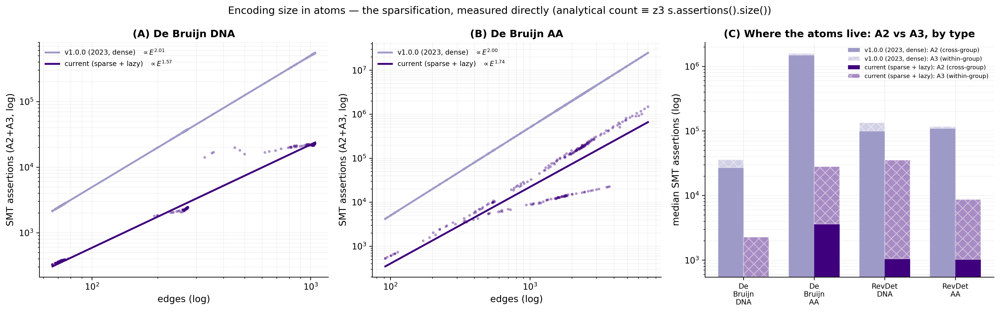

Before any wall-clock number, we can measure the sparsification *itself*. `atom_count.py` computes —
analytically, from each graph's label/endpoint structure — exactly how many `s.add(...)` assertions
each generation emits under `-f`, mirroring `smt.cpp` line for line. The count is **validated to be
exact**: on a 12-graph calibration set it equals z3's own `s.assertions().size()` from an
instrumented build (`recognizer_linux_instr`) to the atom, the only residual being a shared
`n+1`-assertion range/`distinct` baseline identical across all three binaries. The counts over all
**900 biological graphs** (`data/atom_counts.csv`) fit clean power laws in the edge count `E`:

| type | pre-4.1 | this work | atom reduction at the largest graph | what carries it |
|---|--:|--:|--:|---|
| De Bruijn **DNA** | `∝ E^2.00` | **`∝ E^1.57`** | `E=1049`: 549,676 → 22,843 (**24×**) | A3 block fires (`D/E≈0.27`) — an **asymptotic** drop |
| De Bruijn **AA** | `∝ E^2.00` | `∝ E^1.74` | `E=7025`: 24.7 M → 1.48 M (**17×**) | A2 only (block off, `D/E≈0.78`) — a **constant-factor** drop |
| RevDet **DNA** | `∝ E^2.00` | `∝ E^1.94` | `E=1490`: 1.11 M → 293 k (**3.8×**) | few labels ⇒ little A2; block off |
| RevDet **AA** | `∝ E^2.00` | `∝ E^1.80` | `E=1721`: 1.48 M → 102 k (**15×**) | A2 (20-letter alphabet) |

This is the honest, quantitative shape of the improvement. The old encoding is **`∝ E²` on every
type** — the dense all-pairs baseline. The new encoding is genuinely **sub-quadratic only where the
A3 block fires** (few-label DNA: `E^1.57`); on the 20-letter amino-acid graphs the block stays off
and the win is a large **constant factor** from the A2 sparsification, not a change of exponent (the
fit stays near `E^1.8`–`E^2.0`). Panel (C) shows where the atoms live: pre-4.1 is dominated by the
cross-group A2 term on AA and by the within-group A3 term on DNA; the new encoding shrinks whichever
dominates.

**The crucial caveat — atoms are not wall time.** The formula shrinks by a **median ≈13×** (per-type
medians 3.8–16×; up to ~300× on the largest many-label graphs), and the *encoding setup* time shrinks
in step (≈ 14× on the headline graph, §4.1). But the **total** `-f` wall time falls only
≈ 2× (§4.1, §4.5), because z3's **solve** is the bottleneck and its cost is not proportional to the
atom count — a smaller formula helps the solver, but does not shrink the underlying NP-hard search by
the same factor. So the sparsification's first-order effect is to make *building the problem* nearly
free; the solver speedup is a real but second-order benefit.

### 4.1 Setup/solve split on the headline graphs (Fig 7)

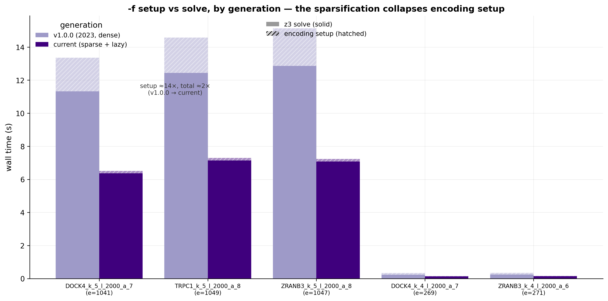

Measured (median of 3, `data/micro.setup_solve.csv`), DOCK4 De-Bruijn DNA k=5 (1041 edges):

| phase | pre-4.1 | pre-4.2 | **NEW** | NEW vs pre-4.1 |
|---|--:|--:|--:|--:|
| SMT setup (encoding build) | 2.11 s | 1.88 s | **0.14 s** | **≈ 14.5×** |
| SMT solve (z3) | 13.04 s | 12.33 s | **6.44 s** | **≈ 2.0×** |
| **total `-f`** | **15.15 s** | 14.21 s | **6.59 s** | **≈ 2.3×** |

The setup win is almost entirely **A3 (Phase 4.2)**: pre-4.1 → pre-4.2 barely moves setup
(2.11 → 1.88 s) because these few-label DNA graphs have little cross-group (A2) cost, whereas
pre-4.2 → NEW collapses it (1.88 → 0.14 s). The smaller formula also roughly halves z3 solve time.
TRPC1 k=5 (1049 edges) shows the same shape (setup 2.24 → 0.16 s, total 15.7 → 8.0 s).

### 4.2 Distribution across the real corpus — and a regression this report found and fixed (Figs 4–6)

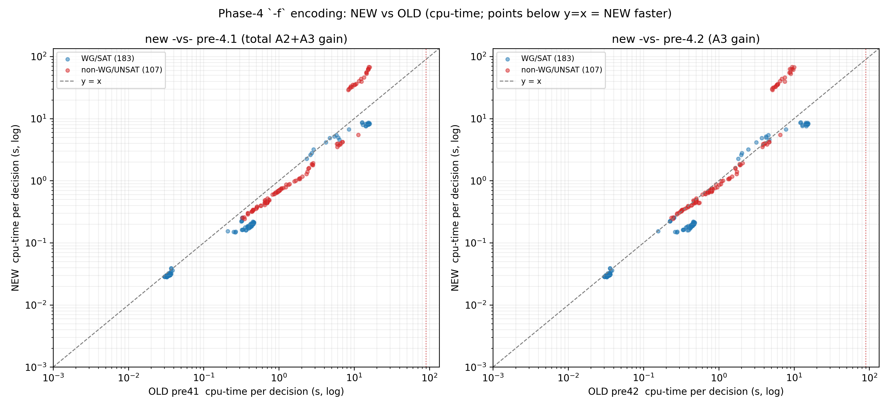

3-point sweep (pre-4.1 / pre-4.2 / NEW), `-b -f`, **string labels** (no `-i`, matching the biological
corpora), median of replicates, all three binaries run **adjacently per graph** (so the per-graph
comparison shares conditions), on **289 DNA graphs** (full DeBruijn k-mer range incl. k=5, plus a
representative non-WG-heavy RevDetG sample). CPU-time medians over the graphs all three decided
(181 WG, 108 non-WG; `data/ftiming_dna2.raw.jsonl`):

| comparison | WG / SAT instances | non-WG / UNSAT instances |
|---|--:|--:|
| **pre-4.1 → NEW** (total Phase-4 gain) | median **1.53×** faster | median **1.42×** faster |
| **pre-4.2 → NEW** (isolated A3 gain)   | median **1.51×** faster | median **1.00×** (≈ neutral) |

**NEW is now ≥ OLD on every DNA graph** — faster on Wheeler graphs (the block encoding fires), and
neutral on non-Wheeler graphs (it falls back). **0 / 289 regressions** beyond measurement noise
(worst remaining non-WG ratio 1.13×), **0 timeouts**.

> **This clean result is the *outcome* of a regression this report's verification caught.** The
> original Phase 4.2 block encoding was gated only by an *atom-count* guard (`D(D-1)+2E < E(E-1)`),
> which fires up to `D/E ≈ 0.7`. The block trades pairwise difference atoms for `2·D` auxiliary
> integer variables; those aux vars **enlarge z3's search** and — measured here — made *solve* time
> **worse** on dense / UNSAT instances even with fewer atoms. Before the fix, the same sweep showed a
> tail of **23 / 107 (≈21%) non-WG graphs where NEW was slower** (worst, wall time: a 525-edge non-WG
> graph **9.5 s → 67.8 s**), and the synthetic `complete` family regressed hard (§5). A setup/solve
> split pinned the loss entirely in z3 **solve** (NEW *setup* was still faster: 0.17 s vs 0.35 s),
> confirming the aux-variable hypothesis. **Phase 4.3** (commit `e37960ec7`) tightens the guard with a
> `D < E/2` clause so the block fires only when it genuinely pays off (De Bruijn graphs, `D/E ≈ 0.25`)
> and otherwise uses the verified pairwise loop. Correctness is unaffected (the block is
> equisatisfiable; the guard only changes *when* it is used) — re-verified at **0 mismatches across
> ~9,700 graphs** (`difftest` std + dense). The table and Figs 4–6 above are the **post-fix** numbers.

Fig 4 is the per-graph scatter (points below y=x = NEW faster), colored by verdict. Fig 5 is the
speedup ECDF split by verdict — both curves now sit right of 1.0 (the pre-fix UNSAT regression tail is
gone; the non-WG curve is a near-vertical step at 1.0 = neutral fallback). Fig 6 is the cactus curve.

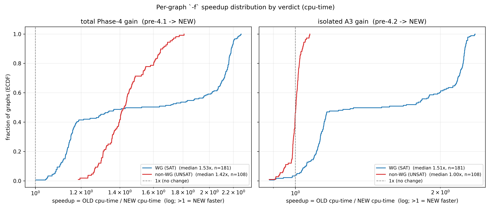
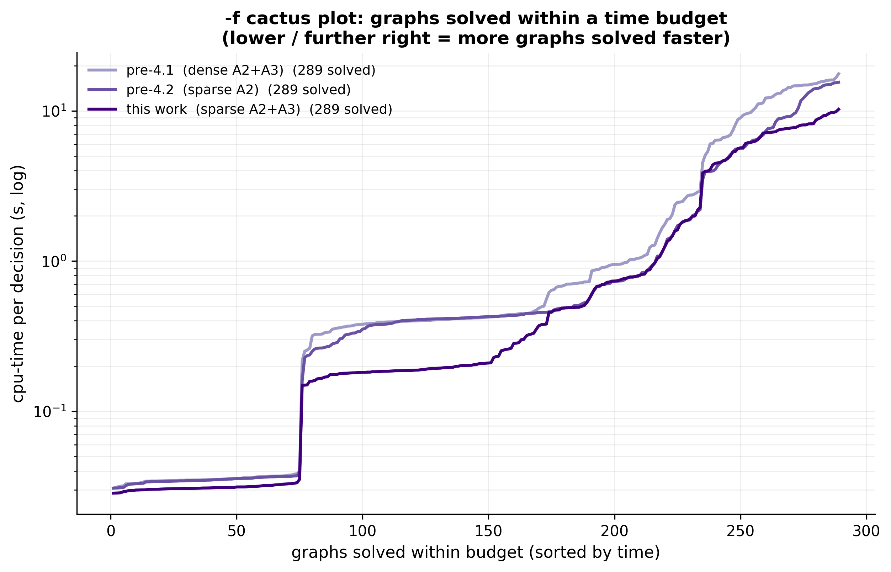

### 4.3 Memory — an honest space-for-time trade (Fig 7b)

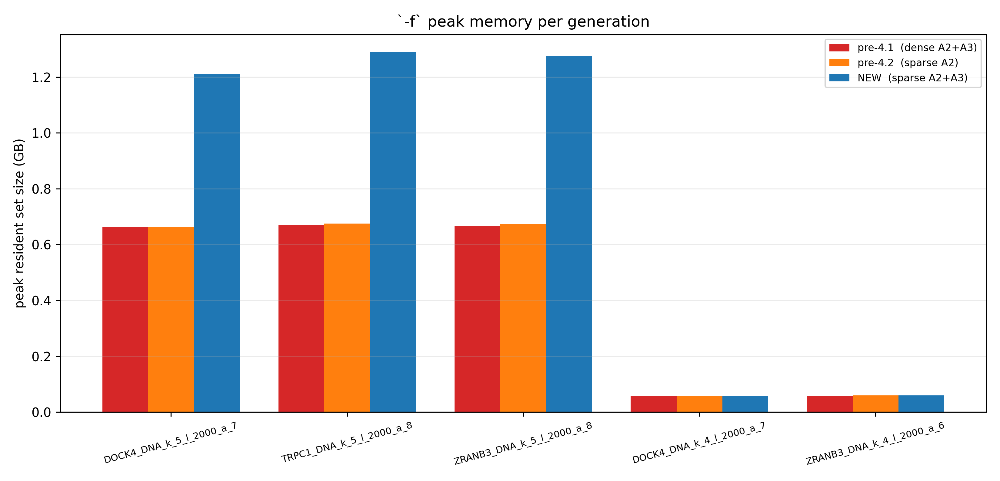

Peak resident set size (`/usr/bin/time -v`) depends on **which** sparsification is active, and splits
into two honest regimes. **(1) Where the A3 block fires** — low-`D/E` graphs, the headline DOCK4/TRPC1
k=5 (`D/E≈0.27`) — the new encoding pays for the block's auxiliary integer variables (`#mn_/#mx_`)
with ≈2× more RAM. That is the genuine space-for-time trade:

| graph | pre-4.1 | pre-4.2 | **NEW** |
|---|--:|--:|--:|
| DOCK4 DNA k=5 (1041 edges) | 0.66 GB | 0.66 GB | **1.21 GB** |
| TRPC1 DNA k=5 (1049 edges) | 0.67 GB | 0.67 GB | **1.29 GB** |

**(2) Where the block is off** — higher-`D/E` graphs, the k=6 De Bruijn DNA ladder of Fig 7b
(`D/E≈0.6–0.85`, `data/micro.mem_ladder.csv`) — there are *no* A3 aux variables, and the sparse A2
form **replaces** pre-4.1's dense `O(E²)` cross-group constraints with `O(E)` ones. So here the new
encoding is **no heavier than pre-4.1** (comparable, and up to ~15–20% lighter on some rungs — e.g.
e=739: 1.88 GB vs 1.59 GB) and indistinguishable from pre-4.2 — none of the ≈2× block-firing penalty.
The memory effect is therefore a **~2× trade only when the A3 block fires, and no cost at all when it
does not** — not the unqualified 2× a single headline graph implies. Either way the time wins (setup ≈14×, total ≈2×) hold; the genuine
limit is z3 *solve* on the all-distinct-endpoint dense cases where `-f` does not finish at all (§4.4).

### 4.4 The honest limit: all-distinct, dense groups

When a label group has (near-)all-distinct endpoints, `D_l ≈ E_l`, the guard's `D_l < E_l/2` clause fails and
the block form correctly **falls back** to the pairwise loop — so there is **no speedup** there. The
extreme case is DOCK4 **AA** k=5 (6636 edges, 20-letter alphabet → many distinct endpoints):
measured (`/tmp` probe, 90 s cap), the `-f` encoding **does not finish setup within 90 s for *any*
generation** — pre-4.1, pre-4.2, and NEW all hit the wall (`timeout`, exit 124). This is a property
of NP-hard recognition under `-f`, not a regression: with all-distinct endpoints there is no block
structure to exploit, so all three versions reduce to the same quadratic encoding.

The point is that **`-f` is the wrong tool for such graphs in the first place**. On the very same
DOCK4 AA k=5 graph, the **default** (range-narrowed) backend prints `(v) Decided after propagation`
and accepts it **instantly** — Step 2's renaming heuristic collapses the order space before any SMT
encoding is built. `-f` exists to hand the *whole* space to the solver (for cases where the
heuristic's narrowing is itself in question); it is not the production path, and Phase 4.1/4.2 speed
up the cases where `-f` *is* tractable (few-label, high-multiplicity graphs) without changing the
fact that the default backend is what one runs in practice.

### 4.5 Per-graph-type `-f` speedup: which sparsification pays where (Fig 12)

§4.1–4.4 explain the encoding wins on headline graphs; this section measures them **across the four
biological graph types** to answer Q1 ("how much faster, by graph type"). The 3-point sweep
(`ftiming.py`, `-b -f`, string labels, median of replicates) runs all three binaries **adjacently per
graph** so each per-graph comparison shares conditions, and splits two contributions: **pre-4.1 → NEW**
(the *total* Phase-4 gain: A2 cross-group + A3 within-group) and **pre-4.2 → NEW** (the *isolated* A3
within-group block). Verdicts are split WG vs non-WG. The 0-regression check classifies each cell as a
real regression (median < 0.98×) or a break-even within wall-clock noise (0.98–1.0×); **no real
regression appears — every type is ≥ break-even.**

> **Pairing note.** The sweep is **complete — all 900 timing jobs ran.** The table below uses the
> **682 jobs with complete timing across all three binaries** (both the OLD baseline and NEW must be
> DECISIVE within the 120 s cap to form a ratio). The remaining 218 are the largest amino-acid
> instances where one or more binaries exceed the cap (all-timeout, so no finite ratio exists) —
> overwhelmingly cases where the *OLD* pre-4.1 binary times out while NEW also does, so their exclusion
> makes the total-column speedups **conservative lower bounds** on the largest graphs, not an optimistic
> subset. `new` returned a decision on 718 / 900 graphs (182 timeouts, all large `l = 2000` amino-acid).

| graph type | verdict | n | pre-4.1 → NEW (total) | pre-4.2 → NEW (A3 only) |
|---|---|--:|--:|--:|
| De Bruijn **DNA** | WG | 225 | **1.82×** | **1.77×** |
| De Bruijn **AA** | WG | 69 | **1.94×** | 1.01× (break-even) |
| RevDet **DNA** | non-WG | 182 | **1.62×** | 1.00× (break-even) |
| RevDet **DNA** | WG | 8† | 1.28× | 1.00× (break-even) |
| RevDet **AA** | non-WG | 196 | **2.18×** | 1.00× (break-even) |
| RevDet **AA** | WG | 2† | 1.69× | 1.01× (break-even) |

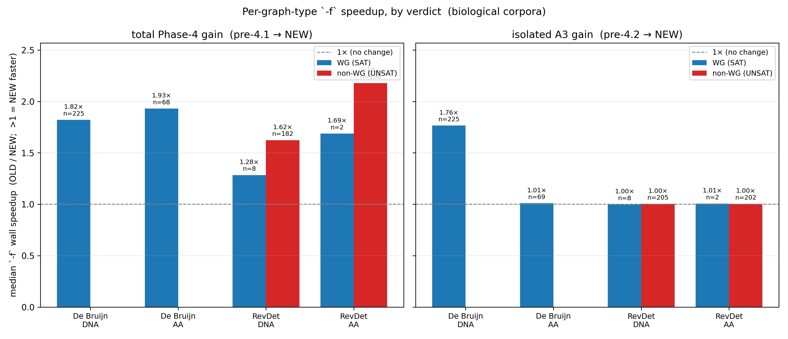

**The total OLD→NEW `-f` speedup is 1.3–2.2× across all four types**, on both WG and non-WG instances —
never a regression. The more interesting result is *where the two sparsifications pay*, which the A3
column isolates and which tracks alphabet size exactly:

- **DNA (4-letter alphabet → few label groups):** the win is the **A3 within-group block**. De Bruijn
  DNA is 1.77× from A3 alone (pre-4.2 → NEW) out of 1.82× total — A2 adds almost nothing, because
  few-label graphs have little cross-group cost (mirrors §4.1: pre-4.1 → pre-4.2 barely moves DNA).
- **AA (20-letter alphabet → many label groups):** the win is the **A2 cross-group sparsification**
  (Phase 4.1). De Bruijn AA is 1.94× total but only 1.01× from A3 — i.e. essentially all the gain is in
  pre-4.1 → pre-4.2, exactly where the many-label A2 cost lives. A3 correctly stays off (the `D < E/2`
  guard), so it is break-even.

So the two encodings are complementary: **A3 dominates the few-label (DNA) regime, A2 dominates the
many-label (AA) regime**, and together they deliver ~1.8–1.9× on De Bruijn graphs and 1.6–2.2× on the
(predominantly non-Wheeler) RevDet graphs. Two honesty caveats: (i) the **RevDet WG cells are small-n**
(†n=8 and n=2) because RevDet graphs are almost never Wheeler on real MSAs (~1% WG, §7) — the
well-powered RevDet cells are the non-WG ones; (ii) every break-even cell is a *true* break-even
(NEW ≡ OLD by construction where the guard keeps A3 off), not a measured slowdown.

#### 4.5.1 The division of labor, and the guard that decides it (Figs “attr”, “guard”)

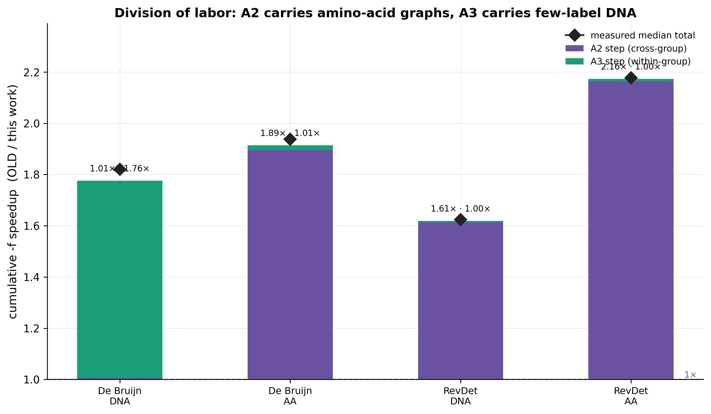

The attribution figure decomposes the *total* per-type speedup into its two multiplicative steps —
the **A2 step** (pre-4.1 → pre-4.2) and the **A3 step** (pre-4.2 → this work) — with the measured
median total marked as a diamond (it lands on top of the stack, validating the decomposition). It
reads off cleanly: De Bruijn DNA is almost all **A3** (1.01× · 1.76×), every other type is almost all
**A2** (De Bruijn AA 1.89× · 1.01×, RevDet AA 2.16× · 1.00×). 

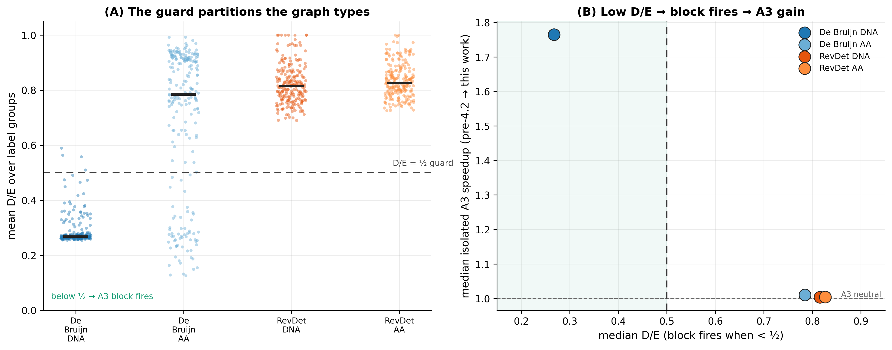

*Why* the split falls this way is the `D/E` guard, and it is fully mechanical (`data/atom_counts.csv`):
**(A)** the per-graph mean `D/E` (over label groups) clusters at **≈ 0.27 for De Bruijn DNA** — below
the `D < E/2` line, so the A3 block fires — and at **≈ 0.78–0.83 for the other three types**, above
the line, so the block stays off and A3 is a true break-even. **(B)** the per-type A3 speedup tracks
`D/E` exactly: only the low-`D/E` De Bruijn DNA point lifts off 1.0×. So the per-type speedup table is
not a list of empirical curiosities — it is the `D < E/2` guard, applied to the alphabet-driven
endpoint multiplicity of each construction.

---

## §5 Scalability — how large a graph can each algorithm recognize?

The `benchmark/limit_test/` harness climbs a geometric size ladder per (algorithm, family) under a
**600 s** wall-clock timeout, takes the **median of R=3** replicate graphs per rung, and bisects the
largest size still decided. Every rung doubles as a large-scale differential correctness test: the
`complete` and `dnfa` families are Wheeler **by construction**, so every decisive verdict must be WG
(the brute oracle anchors the small rungs) — **0 correctness failures across the whole sweep
(CLEAN)**. Limits are **typed**: **THRESHOLD** = timeout-bounded (the algorithm would keep going with
more time), **CAPPED** = a hard capability ceiling (`exp` over its n!·e² budget; `full` = z3 returns
`unknown`/UNDECIDED, *not* a timeout; `wheelerize` trie-too-large), **UNREACHED** = no wall hit up to
the ladder top. The `complete` family (all-distinct dense groups) is the symmetric worst case.

Final limits (`benchmark/limit_test/results/summary/limit_summary.csv`):

| backend | `complete` family | `dnfa` family | limit type |
|---|--:|--:|---|
| **default SMT** | **2816** (median 500 s) | **2176** (532 s) | THRESHOLD (timeout) |
| permutation (`-s p`) | **240** (0.3 s) | **256** (33 s) | THRESHOLD (timeout) |
| full-range `-f`, **NEW** | **832** (182 s) | **832** (161 s) | CAPPED (z3 UNDECIDED) |
| full-range `-f`, **OLD** (pre-4.2) | **832** (177 s) | **832** (161 s) | CAPPED (z3 UNDECIDED) |
| exponential (GT) | **10** | **10** | CAPPED (n!·e² budget) |
| repair (`wheelerize`) | — | — | UNREACHED **8192** |

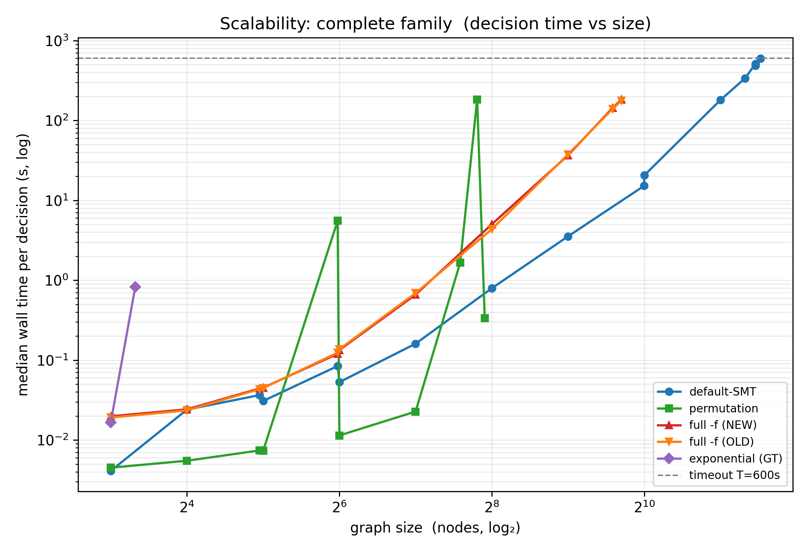
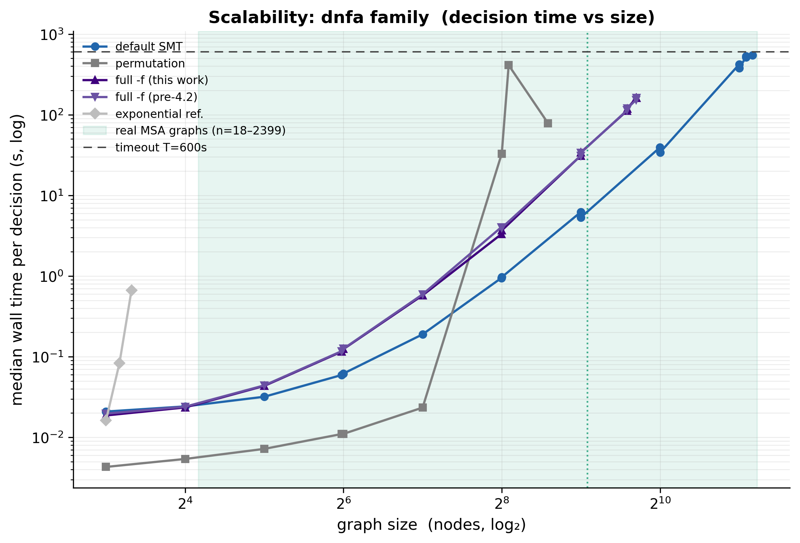
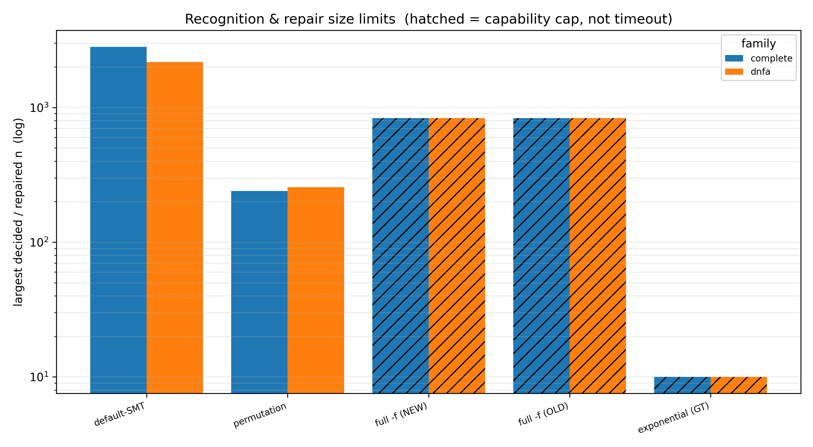

**The default range-narrowed SMT backend is the decisive scaler.** It decides ~**2816**-node
`complete` graphs (and ~2176 `dnfa`) inside 600 s — and its limit is a *timeout*, not a wall, so it
keeps climbing with more time. That is **~3.4×** past the full-range backend (832), **~12×** past the
permutation backend (240), and **~280×** past the exponential baseline's hard capability cap (10).
This is exactly why range-narrowing (Step 2 of the pipeline) is the production default: it shrinks the
search space *before* the solver runs, and nothing else comes close.

**The `-f` size ceiling is identical for NEW and OLD — and it is a z3 capability wall, not a
timeout.** Both the NEW (Phase 4.2/4.3) and OLD (pre-4.2) full-range encodings stop at exactly
**n=832** on both families, where z3 returns `unknown` (UNDECIDED) rather than a model or `unsat`.
This is the honest, important nuance for the three-axes rule: **Phase 4.2/4.3 buys per-graph *time*
(§4.2, ~1.5× on the real DNA corpus), not a higher *size* ceiling.** The ceiling is a property of z3
on this `QF_IDL` encoding, the same for both. Fig 10 makes this concrete — on `complete` the OLD and
NEW `-f` time curves essentially **coincide** and terminate at the same point (median 177 s vs 182 s
at the wall, within noise). They coincide *because* `complete` is dense (`D/E ≈ 0.70`), so Phase 4.3's
tightened guard correctly keeps the A3 block **off** and NEW falls back to the verified pairwise loop
— making NEW ≡ OLD here by construction. **Fig 10c** shows the contrasting case: a real-shaped
De Bruijn DNA size ladder (`data/ftiming_f_sparse.raw.jsonl`, `-b -f`, R=3, 120 s cap), where the
sparser encoding *does* pull ahead. Unlike the dense synthetic families, here NEW and pre-4.2 run
**~1.5× below** pre-4.1 and decide a graph (`e≈1160` / `n≈721`, ≈89 s) that pre-4.1 has already timed
out on, before all three hit the same 120 s wall at `e≈1491` / `n≈816`. The mechanism at these decided
sizes is the **cross-group A2** sparsification, not the A3 block: these k=6 graphs have `D/E ≈ 0.6–0.85`
on the rungs that finish, so the guard keeps A3 *off* (NEW ≈ pre-4.2) and the block engages only on the
larger rungs that all exceed the budget. So A2 and A3 each dominate different De Bruijn sub-regimes —
A3 on the lower-`D/E` k=3–5 corpus of §4.5, A2 on this higher-`D/E` k=6 ladder — but either way **the
encoding lowers the time curve, not the size wall**: the gap below the wall is the speedup; the wall
itself (the same z3/timeout limit for all three) does not move.

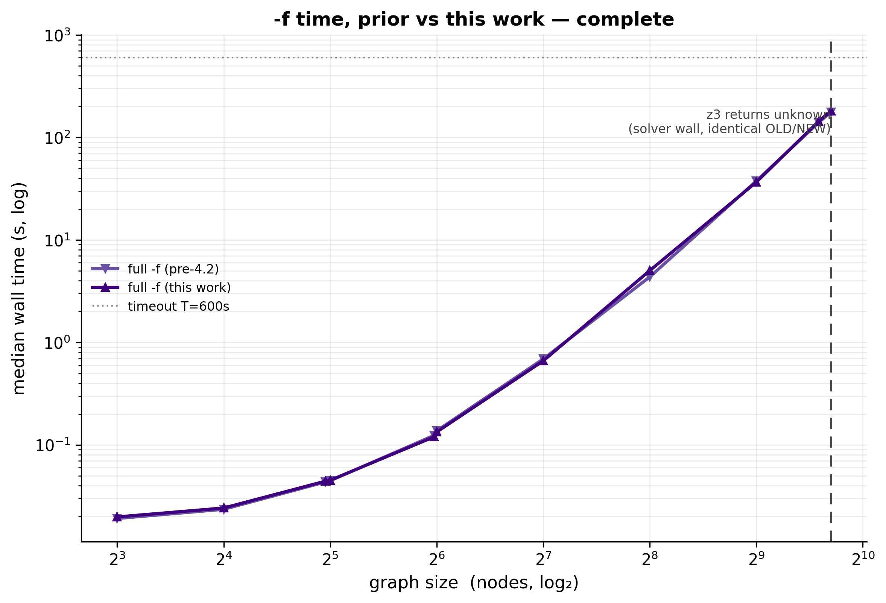
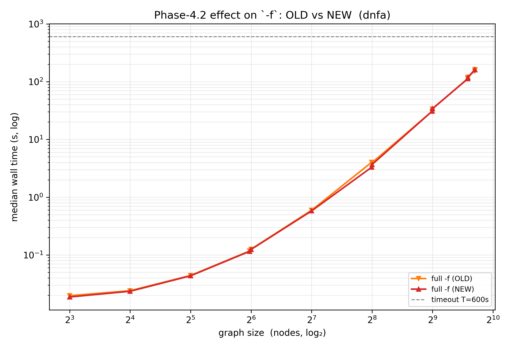
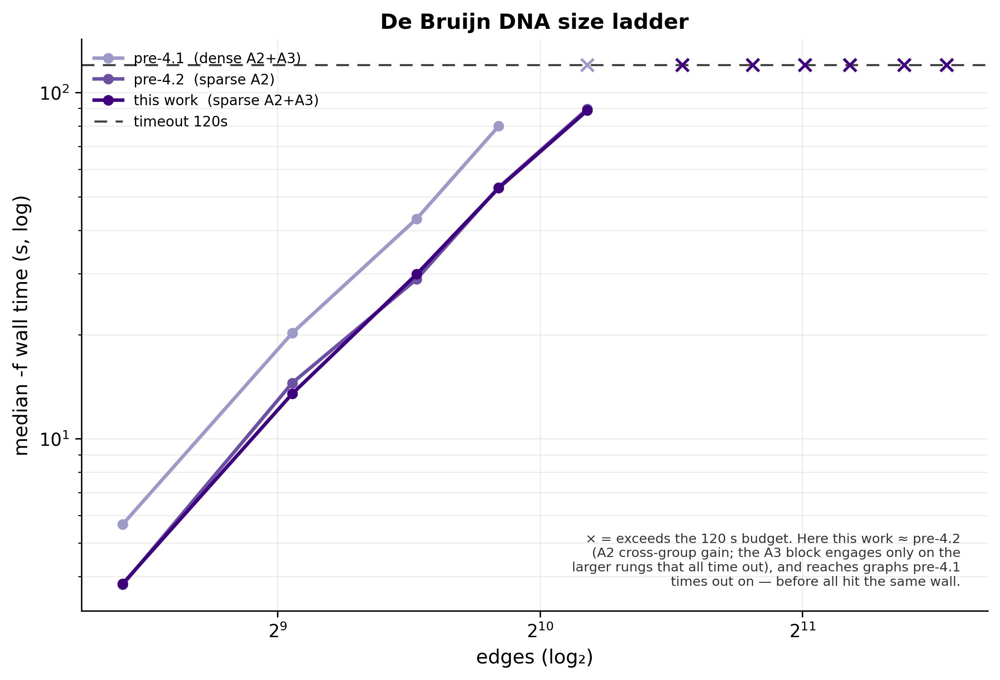

> **Methodology note — a confound this report caught and corrected.** An earlier draft of this table
> reported `full` (NEW `-f`) capping at **n=384**, below the OLD `-f`'s 832 — which would have wrongly
> read as a *regression*. That number was a **measurement artifact**: the `full` rungs had run
> concurrently with the `-f` timing and correctness sweeps, under heavy machine load, so they timed
> out early. Re-running `full` **clean** (idle machine) gives **832**, identical to `full-old`. The
> committed CSV is the clean re-run. Contention can masquerade as an algorithmic difference; isolating
> the measurement is what kept the §5 conclusion honest (no false regression, no false speedup).

The exponential baseline caps at **n=10** — not a timeout but its n!-ordering enumeration budget
(O(n!·e²)); past that it returns `-1`/over-cap by design. Repair (`wheelerize`, §6) never hit a wall:
trie construction is near-linear, so it reached the ladder top (**8192**) UNREACHED.

### 5.1 In one hour: a few thousand nodes — far past anything real data produces (Figs 13–14)

The 600 s limit above is a *timeout*, not a wall, so the natural follow-up is: **given a full hour, how
large a graph can the production default decide?** A fresh **3600 s** sweep — default-SMT only, **R=2**,
the same ladder→bisect — answers it. It runs into a clean `results_1hr/` directory on purpose: the
run cache is keyed *without* the timeout, so reusing the 600 s directory would inherit its TIMEOUTs as
false caps. Every rung again doubles as a large-scale differential correctness test (`complete`/`dnfa`
are Wheeler **by construction**): **0 correctness failures across the whole 1-hour sweep (CLEAN)**.

| backend | `complete` family | `dnfa` family | limit type |
|---|--:|--:|---|
| default SMT, **600 s** | 2816 (median 500 s) | 2176 (532 s) | THRESHOLD (timeout) |
| default SMT, **3600 s** | **4608** (median 3128 s ≈ 52 min) | **3584** (median 3519 s ≈ 59 min) | THRESHOLD (timeout) |

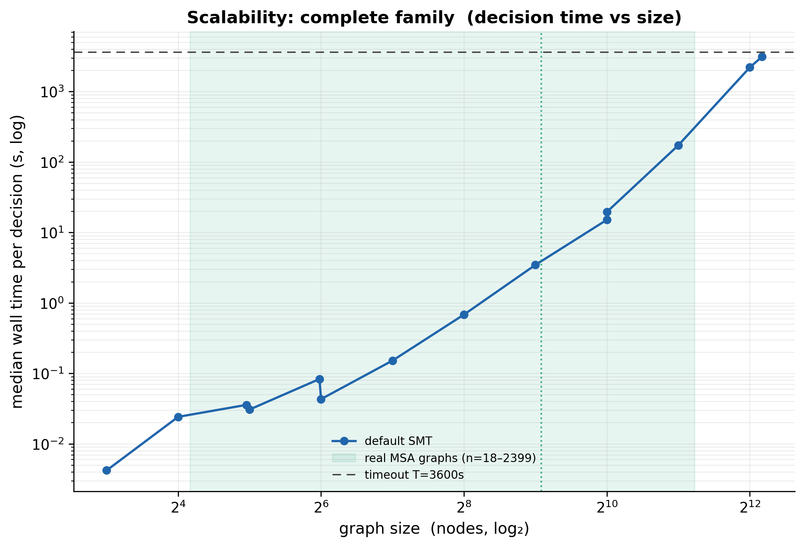
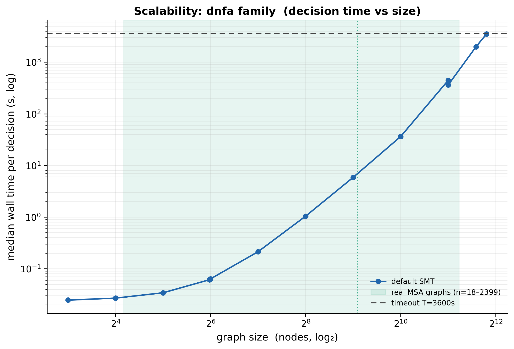
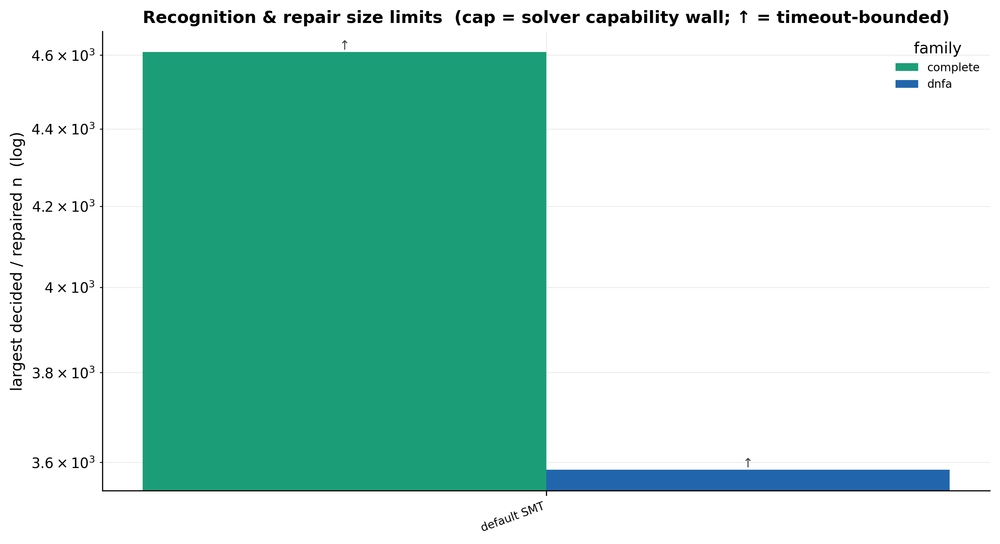

**Six times the time budget buys only ~1.64× the size** (complete 2816 → 4608 = 1.64×; dnfa 2176 →
3584 = 1.65×). That sub-linear return is the signature of the cost: on these symmetric worst-case
families z3's `QF_IDL` search grows steeply with n (Fig 13 is near-straight on a log-time axis), so the
*size* ceiling creeps up slowly even as the *time* budget multiplies. The limit is still **THRESHOLD**
(z3 is making progress at the wall, not returning `unknown`), so more time would push it further — just
slowly.

**The headline, though, is the green band in Fig 13: real biology sits an order of magnitude below the
ceiling.** Across the 500-graph practicality study (§7), the largest De Bruijn / reverse-deterministic /
trie graph built from a real Ensembl MSA is **n = 2399 nodes** (median 541), and **every one was
decided in under a second**. The multi-thousand-node, hour-long runs are a synthetic worst-case stress
test, not a practical limit: for the graphs molecular biology actually produces, recognition is
**instant**, with large headroom before the hour-scale regime even begins.

### 5.2 What about running in parallel? (the honest answer)

A natural question is whether parallelism would raise this ceiling. It would not, and the reason is
structural. At scale the recognizer's wall time is **almost entirely the Z3 `QF_IDL` solve** — on the
headline `-f` graph the solve is **~98 %** of total and encoding/setup only ~2 % (Fig 7,
`data/micro.setup_solve.csv`), and the gap only widens with size because solve cost grows faster than
setup. So "parallelize the recognizer" really means "parallelize a single z3 `QF_IDL` query," and z3's
parallel/portfolio mode gives no reliable speedup for one such query — a prototype with
`parallel.enable` showed no measurable wall-time gain on the worst-case families (the prototype was not
retained, so this is reported as a qualitative finding, not a committed benchmark). The only other
component, the Step-2 range-narrowing heuristic, is a **sequential Gauss–Seidel fixpoint** (a
prefix-sum relabel with intra-pass dependencies) and is a small fraction of runtime, so parallelizing
it cannot move the ceiling either. **The honest answer to "how large in parallel" is therefore ≈ the
serial size.** The numbers in this section are reported as serial figures — the operative ones — rather
than dressed up as a parallel speedup the architecture cannot deliver.

---

## §6 Repair — turning a non-Wheeler graph into a Wheeler graph (Fig 11)

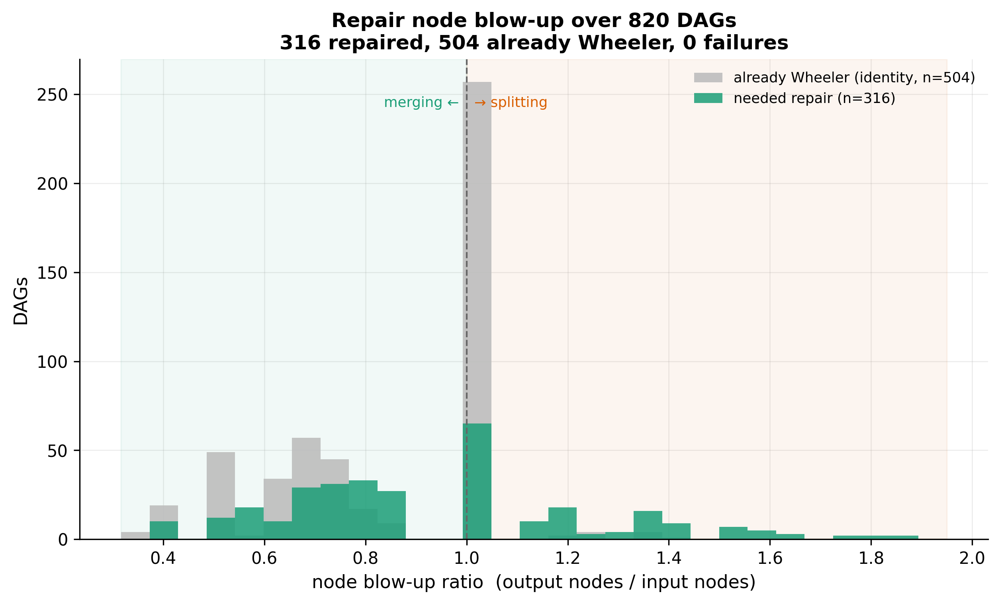

`repair/wheelerize.py` (Phase 5) repairs a **DAG** into a Wheeler graph by unfolding it into the
**trie of its path-strings**. A trie is always a Wheeler graph (order by co-lex of the incoming
string), so this **always succeeds for a DAG**, and it preserves the **set of path-strings** exactly.
Each run self-verifies three ways (recognizer accepts; oracle accepts when small; path-string set
equals the input's).

Over **820** random DAGs, **316** needed repair (504 were already Wheeler) and **0** failed
verification (`data/repair_records.json`). The node blow-up ratio averaged **0.87×**
(range 0.33×–1.86×); Fig 11 shows the full distribution (a spike at 1.0 = unchanged, a sub-1.0
cluster = merging, a >1.0 tail = genuine node-splitting).

> **Read the ratio correctly.** Blow-up `<1` is **merging**, not compression of information: nodes
> that spell the same string are merged, so the *node count* can drop while the represented
> path-string **set** is preserved exactly (multiplicity and node identity are not). Ratios `>1` are
> genuine node-splitting. This first version is not minimal (minimal node-splitting is future work).

---

## §7 From MSA to Wheeler graph — constructions, practicality, and a turnkey CLI

The recognizer *decides* whether a graph is Wheeler; it does not say where biological graphs come
from. This section closes that loop: starting from a **multiple-sequence alignment (MSA)**, what graph
do you build, does it tend to be Wheeler, and is recognition fast enough to be a routine step? We
answer empirically on **50 Ensembl ortholog gene MSAs** (25 DNA, 25 amino-acid; 15–328 sequences each;
aligned length 65–144,114 columns), running every MSA through three constructions for **500 graph
builds + recognitions** (`benchmark/report_figs/data/msa_practicality.csv`).

**The three constructions** (all in `generator/`, driven by the same `-k/-l/-a` knobs — `k`-mer size
for De Bruijn, per-sequence length cap `l`, number of sequences `a`):

- **De Bruijn** (`DeBruijnGraph_generator`): the order-(k-1) De Bruijn graph of the sequences' k-mers —
  nodes are distinct (k-1)-mers, each k-mer is an edge labelled by its last character, and identical
  k-mers are **merged** into one node. Compact and the natural choice for assembly-style graphs.
- **Reverse-deterministic column automaton** (`RevDetGraph_generator`): parse the alignment columns
  into an automaton and merge states so that, **reading backwards**, each (state, label) pair has at
  most one predecessor.
- **Trie** (`Trie_generator`): the prefix tree of the (ungapped) sequences.

**Which tend to be Wheeler — measured, and it corrects intuition** (Fig 15A):

| construction | Wheeler-rate (real MSAs) | median size | median recognition |
|---|--:|--:|--:|
| **De Bruijn** | **100%** (300/300) | 330 nodes | 78 ms |
| **Trie** | **100%** (100/100) | 1199 nodes | 169 ms |
| **RevDet** | **1%** (1/100) | 496 nodes | 62 ms |

The trie result is theoretically expected — a prefix tree is a *canonical* Wheeler graph (order nodes
by the co-lex rank of their incoming string), so it is always Wheeler; this is the same fact §6's
repair exploits. The **De Bruijn** result (100% here, across k ∈ {3,5,7} and a ∈ {4,8}) says the
collapsed k-mer graphs of these highly-similar ortholog sets admit a Wheeler order at every setting we
tried. The striking one is **RevDet: just 1% (1/100)** — despite being *reverse-deterministic*, the
column automaton almost never admits a single global Wheeler order on real MSAs (the lone exception was
*DOCK4* DNA at a=4). Reverse-determinism is necessary but nowhere near sufficient for Wheeler-ness.

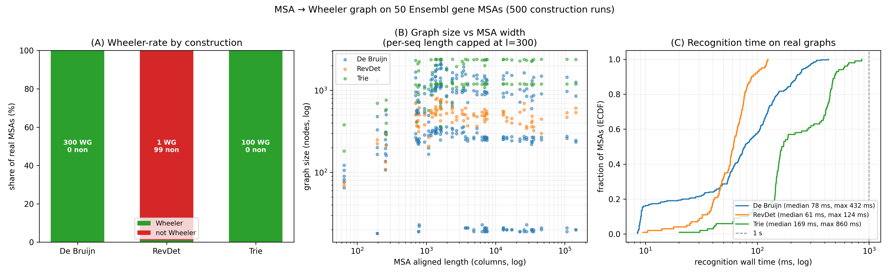

**Practicality — recognition is instant on real data.** Across all **500** runs, **every** graph was
decided in **under one second** (Fig 15C): De Bruijn median 78 ms (max 432 ms), RevDet median 62 ms
(max 124 ms), trie median 169 ms (max 860 ms). Graph size stays bounded and grows only mildly with MSA
width (Fig 15B): the largest graph in the study was a 2,399-node trie, decided in 455 ms. These sizes
sit **far below** the scalability ceiling of §5 (the production SMT backend clears multi-thousand-node
*dense synthetic* graphs, and real biological graphs are far sparser and easier) — so for MSA-derived
graphs the recognizer is never the bottleneck; construction and I/O dominate. *(Honesty caveat: per
sequence length is capped at l=300. Uncapped, a trie/RevDet of a 144k-column alignment would blow up to
~10⁶ nodes — a construction-scale problem, not a recognition one; the sub-second claim is for the
realistic capped sizes that the study sweeps.)*

**Turnkey CLI.** `pipeline/fasta_to_wg.py` chains these existing tools end-to-end — FASTA MSA in →
chosen construction → DOT → recognizer → verdict + size + wall time out — adding no new graph logic:

```bash
python3 pipeline/fasta_to_wg.py MSA.fa --generator debruijn -k 5 -l 200 -a 8
python3 pipeline/fasta_to_wg.py MSA.fa --generator revdet  -l 100 -a 10 --backend f --keep-dot out.dot
python3 pipeline/fasta_to_wg.py MSA.fa --generator trie    -a 6 --tsv     # machine-readable row
```

The whole-corpus practicality sweep behind Fig 15 is `pipeline/msa_practicality.py`.

---

## §8 Discussion

- **Correct first, fast second.** The most consequential change is not a speedup — it is that the
  recognizer and the exponential baseline now give *trustworthy* verdicts. The OLD permutation
  backends and the OLD exponential baseline both shipped false-accepts; any downstream conclusion
  that relied on their "Wheeler" answers was unsupported.
- **The published GT figure was measuring noise.** The OLD exp produced no non-Wheeler verdicts and
  timed out on most graphs, so the published `GT_vs_WGT` verdicts were meaningless and its timings
  reflected useless work. Re-running with the honest binary changes both the verdicts and the cost
  model (n!-ordering enumeration, not `2^(e+n)`).
- **Verification didn't just measure the improvement — it improved it.** Building this report's
  OLD-vs-NEW sweeps surfaced that Phase 4.2's block encoding, gated only by an atom-count guard,
  *regressed* z3 solve time on dense / UNSAT instances (the aux variables enlarge the search): a tail
  of ~21% of non-WG DNA graphs and the entire synthetic `complete` family (n=512: 36.5 s → timeout)
  were slower than the OLD code. That is the kind of finding an honest benchmark exists to catch.
  Phase 4.3 added a `D < E/2` clause so the block fires only where it pays off; re-verified at 0
  mismatches across ~9,700 graphs, and the regressions are gone (§4.2, §5). Net: the sparse forms now
  have a strictly-smaller-or-equal *constraint count* **and** are ≥ the OLD code on every graph
  measured — faster on Wheeler instances (median ~1.5×), neutral on non-Wheeler. Encoding *setup*
  shrinks universally (~14× at k=5). Crucially the **default** backend is untouched and is what runs
  in practice; `-f` is the completeness path.
- **Scope honesty.** `-f` is an NP-hard full-search path; no encoding makes it polynomial. The
  default range-narrowed backend is what makes recognition fast in practice; `-f` exists for
  completeness and for graphs where the heuristic's narrowing is itself the question.

---

## §9 Reproducibility

**Build (Linux), run from `recognizer/`:**
```bash
g++ -std=c++17 -pthread -O3 -w -I /home/kh.chao/miniconda3/include/ \
    $(find src -name '*.cpp') src/libz3.a -lstdc++fs -o bin/<name>
```
OLD binaries were built from the commits in §2 via `git worktree add /tmp/wgt-old-X <commit>`.

**Sweeps** (all under detached `tmux`; outputs in `benchmark/report_figs/data/`):
```bash
# S1 correctness (buggy vs NEW), S2 exp soundness (unsound vs honest)
bash benchmark/report_figs/run_correctness.sh
# S3 3-point -f timing (pre41/pre42/new) on the real DNA then AA corpora
bash benchmark/report_figs/run_ftiming.sh
# S3b per-graph-type -f speedup (§4.5, Fig 12): same 3 binaries over the 4 biological type dirs
python3 benchmark/report_figs/ftiming.py \
    --binaries 'pre41=recognizer/bin/recognizer_pre41,pre42=recognizer/bin/recognizer_linux_old,new=recognizer/bin/recognizer_linux' \
    --corpus 'data/graph/SMT_vs_RHSMT/{DeBruijnG_DNA,DeBruijnG_AA,RevDetG_DNA,RevDetG_AA}' \
    --timeout 120 --replicates 3 --out benchmark/report_figs/data/ftiming_bytype
# S3c encoding size in atoms (§4.0, Fig "atoms"/"attr"/"guard") — analytical, no run; validated
#     exactly against recognizer_linux_instr (s.assertions().size())
python3 benchmark/report_figs/atom_count.py \
    --corpus 'data/graph/SMT_vs_RHSMT/DeBruijnG_DNA,data/graph/SMT_vs_RHSMT/DeBruijnG_AA,data/graph/SMT_vs_RHSMT/RevDetG_DNA,data/graph/SMT_vs_RHSMT/RevDetG_AA' \
    --out benchmark/report_figs/data/atom_counts.csv
# S3d sparse-family OLD-vs-NEW -f ladder + memory ladder (§4.3, §5 Fig 10c) — De Bruijn DNA, tmux
bash benchmark/report_figs/run_f_sparse_ladder.sh
# S4 setup/solve split + peak RSS, S5 repair blow-up dump
bash benchmark/report_figs/run_micro.sh
# scalability limit test (600 s timeout, R=3)
python3 benchmark/limit_test/limit_test.py --timeout 600 --replicates 3 \
    --families complete,dnfa,random-dag --algorithms smt,perm,full,exp,wheelerize --old-f \
    --out benchmark/limit_test/results
# S5b 1-hour SERIAL ceiling (§5.1) — FRESH dir (cache key has no timeout; reuse would inherit 600 s caps)
python3 benchmark/limit_test/limit_test.py --timeout 3600 --replicates 2 \
    --families complete,dnfa --algorithms smt --out benchmark/limit_test/results_1hr
# S6 MSA → Wheeler-graph practicality (50 Ensembl gene MSAs × 3 constructions × k/a, l-capped)
python3 pipeline/msa_practicality.py --out benchmark/report_figs/data/msa_practicality.csv
```

**Figures** (render with the spliceai python):
```bash
~/miniconda3/envs/spliceai/bin/python benchmark/report_figs/plot_report.py   # F1–F15 incl. Fatoms/Fattr/Fguard/F10c
~/miniconda3/envs/spliceai/bin/python benchmark/report_figs/compose_figs.py   # composite rfig_*.png → website assets
~/miniconda3/envs/spliceai/bin/python benchmark/limit_test/plot_limit.py \
    --results benchmark/limit_test/results                                    # F8–F10 (600 s)
~/miniconda3/envs/spliceai/bin/python benchmark/limit_test/plot_limit.py \
    --results benchmark/limit_test/results_1hr \
    --bio-csv benchmark/report_figs/data/msa_practicality.csv                 # F13–F14 (1 h, real-MSA band)
```

| Figure | Data file | Generator |
|---|---|---|
| F1 false-accepts | `data/corr_buggy.log`, `data/corr_new.log`, `data/exp_unsound.log` | `plot_report.py` |
| F2 verdict agreement | `data/static_metrics.json` (← `VERDICT_AGREEMENT.md`) | `plot_report.py` |
| F3 capability | `data/static_metrics.json` (← `PHASE3_IMPACT.md`) | `plot_report.py` |
| Fatoms / Fattr / Fguard (§4.0, §4.5.1) | `data/atom_counts.csv` (+ `ftiming_bytype.raw.jsonl` for attr/guard) | `atom_count.py` → `plot_report.py` |
| F4–F6 `-f` scatter/ECDF/cactus | `data/ftiming_dna2.raw.jsonl` (post-4.3 fair re-run; AA via §4.4 probe) | `plot_report.py` |
| F7 / F7b setup-solve / memory ladder | `data/micro.setup_solve.csv` / `data/micro.mem_ladder.csv` | `plot_report.py` |
| F10c sparse `-f` ceiling (§5) | `data/ftiming_f_sparse.raw.jsonl` | `plot_report.py` |
| F8–F10 scalability | `limit_test/results/summary/limit_summary.csv` + `raw/runs.jsonl` | `plot_limit.py` |
| F11 repair blow-up | `data/repair_records.json` | `plot_report.py` |
| F12 per-type `-f` speedup | `data/ftiming_bytype.raw.jsonl` | `plot_report.py` |
| F15 MSA practicality | `data/msa_practicality.csv` | `plot_report.py` |

**Honesty gates checked.** Three axes never merged · exp shown as capability/correctness, never a
speedup · `unknown` ≠ reject kept distinct · macOS binary excluded · OLD commit hashes pinned ·
medians over repeats · timeouts recorded as timeouts (never a verdict) · label modes matched per
corpus (biological = string labels, no `-i`).

---

## Appendix A — the bugs, with the test that catches each

Each was found by **oracle disagreement** and is regression-covered. File:line anchors are on
`devel`.

| # | bug | site | fix | caught by |
|---|---|---|---|---|
| 1 | permutation backend false-accepts on search exhaustion | `graph.cpp:592`, `wg.cpp:47,197` | reject at end of `permutation_start` when not exhaustive | `difftest.py` (perm), Fig 1 |
| 2 | `-e` exhaustive mode accepts unconditionally | `wg.cpp:191` | decide by `get_valid_WG_num()>0` | `difftest.py --modes perm-e`, `edgecases.py`, Fig 1 |
| 3 | propagation fast-path accepts with no final check | `graph.cpp:358-363` | run `WG_checker()` before accepting | `difftest.py` |
| 4 | `permutation_counter` `int` overflow → wrong dispatch | `graph.cpp:367-373` | saturating product | large-range graphs |
| 5 | `-f` SIGABRT on empty/isolated-node graphs (`z3::distinct([])`) | `smt.cpp:48,78` | guard `size()>1`; fix `size_t` underflow | `edgecases.py` |
| 6 | `-f` SMT model-extraction clobber (Phase 4.1 aux vars) | `smt.cpp:~166` | skip constants not in `_nodeName_2_newNodeName` | `difftest.py --modes full`, `check_order.py` |
| 7 | `-f` false-reject when z3 returns `unknown` (conflated with `unsat`) | `smt.cpp` `solve_smt` | 3-way: sat/unsat/**unknown=undecided** | `verify/regression/`, `find_f_disagreement.py` |

(Also fixed in the oracle itself: a `n≤1 → Wheeler` shortcut that skipped axiom checks; a single node
with two different-label self-loops violates A2. Now only `n==0` shortcuts.)

**Performance regression found by this report (not a correctness bug):** the Phase 4.2 `-f` block
encoding was gated only by an atom-count guard, which fired up to `D/E ≈ 0.7` and there *slowed* z3's
solve (the `2·D` aux variables enlarge the search) — a 512-node complete WG went 36.5 s → timeout, and
~21% of non-WG DNA graphs regressed (worst 9.5 s → 67.8 s). Building the OLD-vs-NEW `-f` sweeps for
this report surfaced it; **Phase 4.3** (`smt.cpp`, commit `e37960ec7`) adds a `D < E/2` clause so the
block fires only where it pays off, restoring NEW ≥ OLD on every `-f` graph measured. Correctness
unaffected (re-verified 0 mismatches / ~9,700 graphs); see §4.2.
